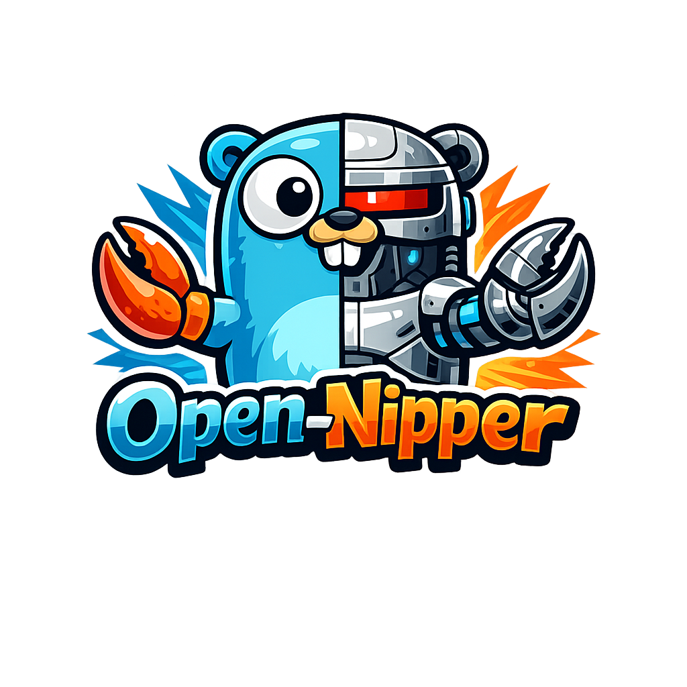

# Open-Nipper

A multi-channel AI gateway that routes messages between messaging channels (WhatsApp, Slack, MQTT, RabbitMQ, cron) and AI agents via RabbitMQ.



## Why Open-Nipper

- **Local AI First:** Designed to run within the constraints of Local AI.
- **Decoupled by design:** Gateway and agents communicate over a queue (RabbitMQ), so you can scale, restart, or deploy them independently.
- **Kubernetes-friendly:** Gateway and agent can run on Kubernetes; the agent needs no sandbox for basic operation.
- **Lightweight:** Single binary for both gateway and agent; no heavy runtime.
- **Skills and MCP:** Supports skills and local or remote MCP (SSE or STDIO); we favour SSE for remote tools.
- **Proven WhatsApp stack:** Uses [Wuzapi](https://github.com/asternic/wuzapi) for WhatsApp; the gateway is decoupled from the messaging network.
- **Sandboxed agent:** With sandbox enabled, the agent runs in containers; you can drop all capabilities if you want.
- **Container and sandbox:** The agent can run in a container; enabling the sandbox requires mounting the container runtime socket (Docker-out-of-Docker). Kubernetes pod sandbox is in the works.
- **Containerized STDIO MCPs:** STDIO MCP servers can run inside the sandbox container, keeping untrusted tools isolated from the host.
- **Support for Speech Recognition:** The agent can recognize speech and use it as a prompt, voice cloning and responses are next.

## Architecture

```
Channels                 Gateway                    Agents
─────────           ─────────────────           ──────────
WhatsApp  ──┐       │ Webhook/Adapter │       ┌── Agent A
Slack     ──┤       │ → Router        │       ├── Agent B
MQTT      ──┼──────►│ → RabbitMQ pub  │──────►├── Agent C
RabbitMQ  ──┤       │                 │       │
Cron      ──┘       │ Event consumer  │◄──────┘
                    │ → Dispatcher    │
                    │ → Adapter       │──────► Response to user
                    └─────────────────┘
```

**Gateway** receives inbound messages from channels, normalizes them, resolves the user, checks the allowlist, and publishes to RabbitMQ. Agent responses arrive as events, get accumulated or streamed by the dispatcher, and are delivered back through the originating channel adapter.

## Prerequisites

- Go 1.22+
- RabbitMQ 3.12+ (core message broker between gateway and agents)
- Optional: Mosquitto or any MQTT broker (for the MQTT channel)
- Optional: Wuzapi instance (for WhatsApp)

## Quick start

```bash
# Build
go build -o nipper ./cmd/nipper

# Copy and edit config
cp config.example.yaml config.yaml
# Edit config.yaml with your settings

# Start the gateway
./nipper serve -c config.yaml
```

The gateway starts two HTTP servers:
- **:18789** -- main server (webhooks, health, agent registration)
- **:18790** -- admin API (localhost only, user/agent management)

## Configuration

See `config.example.yaml` for all options. Key sections:

| Section | Purpose |
|---------|---------|
| `gateway` | Bind address, port, timeouts, admin API |
| `channels.whatsapp` | Wuzapi URL, HMAC key, delivery options |
| `channels.slack` | Bot token, signing secret |
| `channels.cron` | Scheduled jobs with cron expressions |
| `channels.mqtt` | MQTT broker, topics, QoS, reconnect |
| `channels.rabbitmq_channel` | RabbitMQ service-to-service channel |
| `queue` | Internal Gateway-Agent RabbitMQ broker |
| `agents` | Health checks, registration, management API |
| `datastore` | SQLite path, WAL mode, backups |
| `telemetry` | OpenTelemetry tracing and metrics |
| `security` | Rate limits, tool policies |

Environment variables in `${VAR}` syntax are expanded at load time.

---

## User management

Open-Nipper has three concepts for managing access:

| Concept | What it is | Why it exists |
|---------|------------|---------------|
| **User** | A person or service account | Single identity across all channels |
| **Identity** | Maps a channel-native ID to a user | The same person has different IDs on WhatsApp vs Slack vs MQTT |
| **Allowlist** | Per-channel access control | Only allowed user+channel pairs can send messages; others are dropped |

Users get a server-generated ID (`usr_`). Agents are provisioned per user and authenticate with an `npr_` token.

**Quick path — create a user with channels and an agent in one step:**

```bash
nipper admin bootstrap \
  --name "Alice" \
  --channel whatsapp --identity "1234567890@s.whatsapp.net" \
  --channel slack    --identity "U07ABC123" \
  --agent-label "prod-01"
```

This creates the user, adds identities and allowlist entries for both channels, and provisions an agent. The command prints the auth token once; store it for the agent process.

**Add a channel to an existing user:**

```bash
nipper admin user add-channel usr_019539a1... --channel mqtt --identity "sensor-42"
```

For the full data model, CLI reference, and workflows (step-by-step onboarding, allowlist, cron/at jobs, token rotation), see **[docs/USER_MGMT.md](docs/USER_MGMT.md)**.

---

## Agent management

Agents are processes that consume messages from RabbitMQ, call an LLM, and publish responses back. Each agent is provisioned per-user.

### Provision an agent

```bash
nipper admin agent provision --user alice --label "claude-agent"
```

This outputs an **auth token** and connection instructions. The agent uses this token to either:
- Call `POST /agents/register` on the gateway to receive RabbitMQ credentials dynamically
- Or connect directly to RabbitMQ with pre-configured credentials

### Agent commands

```bash
nipper admin agent list                    # List all agents
nipper admin agent list --user alice       # Filter by user
nipper admin agent get <agentId>           # Get agent details
nipper admin agent rotate-token <agentId>  # Rotate auth token
nipper admin agent revoke <agentId>        # Revoke without deleting
nipper admin agent delete <agentId>        # Delete agent and RMQ resources
```

---

## Channel reference

### WhatsApp

Requires a [Wuzapi](https://github.com/asternic/wuzapi) instance. The gateway registers a webhook and receives message events via HTTP POST.

```yaml
channels:
  whatsapp:
    enabled: true
    config:
      wuzapi_base_url: "https://wuzapi.example.com"
      wuzapi_token: "your-token"
      wuzapi_hmac_key: "your-hmac-key"
```

Messages arrive at `POST /webhook/whatsapp`. Responses are delivered via the Wuzapi Send API with optional typing indicators and read receipts.

### Slack

Uses Slack's Events API. The gateway handles URL verification and signature validation.

```yaml
channels:
  slack:
    enabled: true
    config:
      signing_secret: "your-signing-secret"
```

Messages arrive at `POST /webhook/slack`. Responses are posted back via Slack's Web API.

### MQTT

Connects to an MQTT broker and subscribes to per-user inbox topics.

```yaml
channels:
  mqtt:
    enabled: true
    config:
      broker: "mqtt://localhost:1883"
      client_id: "open-nipper-gw"
      topic_prefix: "nipper"
      qos: 1
      reconnect:
        enabled: true
```

**Inbound topic pattern:** `{topic_prefix}/{userId}/inbox`
**Outbound topic pattern:** `{topic_prefix}/{userId}/outbox`

Send a test message:

```bash
mosquitto_pub -h localhost -t "nipper/alice/inbox" \
  -m '{"text":"Hello from MQTT","messageId":"test-001"}'
```

### RabbitMQ (service-to-service)

A separate RabbitMQ channel adapter for service-to-service messaging. This is different from the core Gateway-Agent RabbitMQ broker -- it's a channel for external services to send messages into the gateway.

```yaml
channels:
  rabbitmq_channel:
    enabled: true
    config:
      url: "amqp://localhost:5672"
      username: "nipper"
      password: "nipper"
      vhost: "/nipper"
      exchange_inbound: "nipper.inbound"
      exchange_outbound: "nipper.outbound"
      prefetch: 1
      reconnect:
        enabled: true
```

**Inbound queue pattern:** `nipper.{userId}.inbox` bound to `exchange_inbound`
**Outbound routing key:** `nipper.{userId}.outbox` on `exchange_outbound`

Send a test message:

```bash
rabbitmqadmin -V /nipper -u nipper -p nipper \
  publish exchange=nipper.inbound \
  routing_key=nipper.alice.inbox \
  payload='{"text":"Hello from RabbitMQ","messageId":"test-001"}'
```

### Cron

Headless scheduled jobs. No external transport -- the gateway fires messages on a schedule and broadcasts responses to other channels.

```yaml
channels:
  cron:
    enabled: true
    jobs:
      - id: daily-summary
        schedule: "0 9 * * *"     # 9 AM daily
        user_id: alice
        prompt: "Give me a summary of yesterday's activity"
        notify_channels:
          - "whatsapp:1234567890@s.whatsapp.net"
          - "slack:C0789GHI"
```

The `user_id` must exist and be enabled. Responses are broadcast to `notify_channels` (not back to cron).

---

## Docker-out-of-Docker (sandbox and STDIO MCPs)

When the agent runs inside a Docker container (e.g. via docker-compose), the sandbox and STDIO MCP features need access to a Docker daemon. Open-Nipper uses the **Docker-out-of-Docker (DooD)** pattern:

- The agent container image ships with the **Docker CLI only** (no daemon).
- The host's Docker socket is bind-mounted into the agent container at `/var/run/docker.sock`.
- The agent's sandbox manager calls `docker run` / `docker exec` through the CLI, which talks to the host daemon via the socket.

This is simpler and lighter than running a full Docker-in-Docker (DinD) daemon. Sandbox containers and STDIO MCP containers are siblings of the agent container on the host daemon.

### How it works

```
┌─────────────────────────────────────────────┐
│  Host                                       │
│                                             │
│  docker daemon                              │
│    ├── agent container (has docker CLI)      │
│    │     └── /var/run/docker.sock (mount)    │
│    ├── nipper-sandbox-xxxx (created by agent)│
│    └── stdio-mcp-yyyy     (created by agent)│
└─────────────────────────────────────────────┘
```

### docker-compose setup

The `deploy/docker-compose/docker-compose.yml` already includes the socket mount:

```yaml
agent:
  image: ghcr.io/jescarri/open-nipper:latest
  volumes:
    - /var/run/docker.sock:/var/run/docker.sock
```

### Security considerations

- Mounting the Docker socket grants the agent container the ability to manage containers on the host. This is equivalent to root access on the host.
- Sandbox containers are hardened with `--cap-drop ALL`, read-only root FS, memory/CPU limits, and `no-new-privileges` (see `docs/SANDBOX_APT_CAPABILITIES.md`).
- For production, consider using a socket proxy (e.g. [docker-socket-proxy](https://github.com/Tecnativa/docker-socket-proxy)) to restrict the API surface exposed to the agent.

---

## Testing channels locally

### Docker setup

```bash
# RabbitMQ (always required for the core message broker)
docker run -d --name rabbitmq \
  -p 5672:5672 -p 15672:15672 \
  -e RABBITMQ_DEFAULT_USER=nipper \
  -e RABBITMQ_DEFAULT_PASS=nipper \
  -e RABBITMQ_DEFAULT_VHOST=/nipper \
  rabbitmq:3-management

# Mosquitto (for MQTT channel)
docker run -d --name mosquitto \
  -p 1883:1883 \
  eclipse-mosquitto:2 \
  mosquitto -c /mosquitto-no-auth.conf
```

### End-to-end test (MQTT)

```bash
# 1. Start the gateway
./nipper serve -c config.yaml

# 2. Provision a user
nipper admin user add --id testuser --name "Test"
nipper admin identity add testuser --channel mqtt --identity testuser
nipper admin allow testuser --channel mqtt

# 3. Send a message
mosquitto_pub -h localhost -t "nipper/testuser/inbox" \
  -m '{"text":"ping","messageId":"test-1"}'

# 4. Check the gateway logs -- you should see:
#    "message routed to queue" with userId=testuser
```

Messages will queue in RabbitMQ at `nipper.sessions` (routing key `nipper.testuser`). Without an agent consuming, they'll accumulate. Check `http://localhost:15672` (RabbitMQ management UI) to see them.

### End-to-end test (RabbitMQ channel)

```bash
# Provision user for rabbitmq channel
nipper admin user add --id billing --name "Billing Service"
nipper admin identity add billing --channel rabbitmq --identity billing
nipper admin allow billing --channel rabbitmq

# Publish a message
rabbitmqadmin -V /nipper -u nipper -p nipper \
  publish exchange=nipper.inbound \
  routing_key=nipper.billing.inbox \
  payload='{"text":"Generate invoice for order #1234"}'
```

---

## Operations

### Health check

```bash
# Gateway health
curl -s localhost:18789/health | jq .

# Admin health (includes agent queue stats)
nipper admin health
```

### Backup

```bash
nipper admin backup
```

### Audit log

```bash
nipper admin audit                            # All entries
nipper admin audit --action user.created      # Filter by action
nipper admin audit --user alice --since 2025-01-01T00:00:00Z
```

### Telemetry

Enable OpenTelemetry tracing and/or Prometheus metrics in config:

```yaml
telemetry:
  tracing:
    enabled: true
    exporter: "otlp"
    endpoint: "http://localhost:4318"
  metrics:
    enabled: true
    exporter: "prometheus"
    prometheus_port: 9090
```

---

## Project structure

```
cmd/nipper/            Entry point
cli/                   Cobra CLI commands (serve, admin)
internal/
  admin/               Admin REST API server
  allowlist/           Allowlist guard
  channels/
    whatsapp/          WhatsApp adapter (Wuzapi)
    slack/             Slack adapter
    cron/              Cron scheduler adapter
    mqtt/              MQTT adapter (paho)
    rabbitmq/          RabbitMQ service-to-service adapter
  config/              Configuration loader
  datastore/           Repository interface + SQLite implementation
  gateway/             HTTP server, router, dispatcher, health monitor
  lifecycle/           Ordered shutdown manager
  logger/              Zap logger setup
  models/              Shared data types
  queue/               RabbitMQ broker, publisher, consumer, topology
  ratelimit/           Rate limiter
  security/            Startup audit + runtime monitor
  telemetry/           OpenTelemetry tracing, metrics, middleware
```

## License

See LICENSE file.
